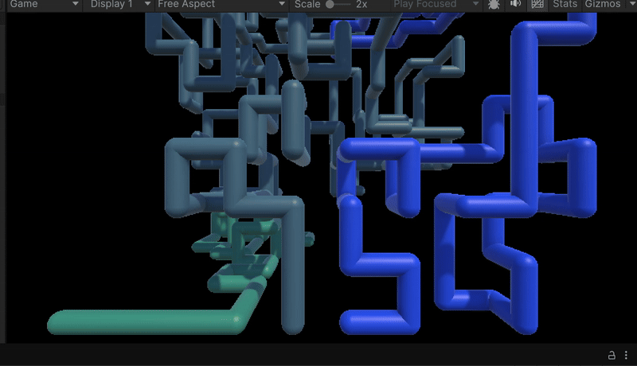
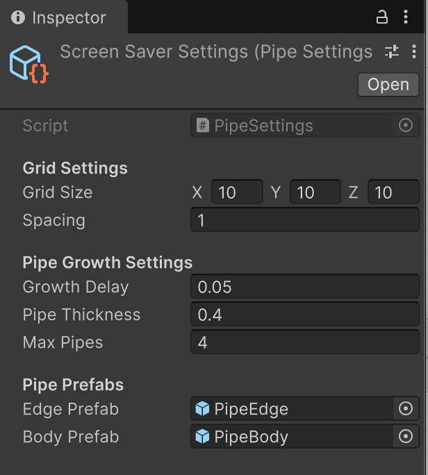

# Windows 95 Pipes Screensaver (Unity Recreation)

## Overview

Recreating the Windows 95 Pipe Screensaver using Unity

## System Architecture

-- **PipeManager** → Combines everything together
-- **PipeGenerator** → Growth logic (decides where pipes grow).  
-- **PipeRenderer** → Presentation of pipe (spawns prefabs, assigns materials).
-- **SpawnGrid** → Checking Neighbouring Cells Availability
-- **PipeSettings** → Configures the pipe settings (Prefabs, Growth Delay)

## Customization

All pipe behavior and visuals are controlled via the "Screen Saver Settings in Assets Folder"

These were the values I found closest to the Screensaver

## How to Run

1. Clone this repo
2. Open in Unity (I'm using Unity 6.2)
3. Open the scene 'screensaver' in Assets/Scene Folder
4. Hit the Play Button

## Future Improvements

-- Maybe have a different slight angle change every time the Grid Resets.
